#! https://zhuanlan.zhihu.com/p/573032543
# S1-Boot XV6 


## Memory-mapped IO

现代的体系结构大多使用[MMIO](https://en.wikipedia.org/wiki/Memory-mapped_I/O)的形式，即使用相同的地址总线来寻址内存和输入输出设备（简称I/O设备），前提是I/O设备上的设备内存和寄存器都已经被映射到内存空间的某个地址。这样当CPU访问某个地址的时候，可能是要访问某一部分物理内存，也可能是要访问I/O设备上的内存。因此，设备内存也可以通过内存访问指令来完成读写。

与之相对的是类似8086上，使用专门的`IN` `OUT`指令进行IO操作。


下图是`qemu-riscv`的物理地址映射图，完整的地址映射可见 [riscv/virt.c#L75](https://github.com/qemu/qemu/blob/42e1e350bffc8d4614e568a03380b2ec34a131bf/hw/riscv/virt.c#L75) 。

其中，**ROM被映射到`0x1000`，DRAM被映射到`0x80000000`地址**，这两个地址之间的为IO设备的映射。

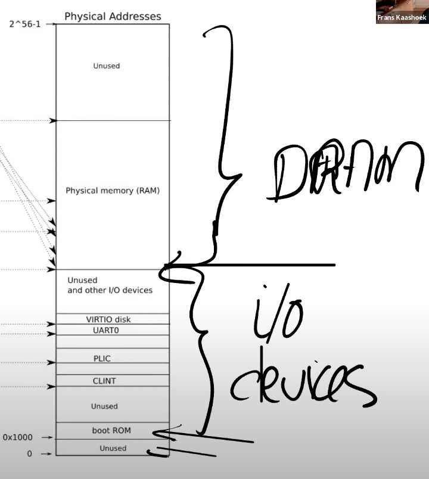


下图是Intel Xeon的地址映射图，作为拓展了解。

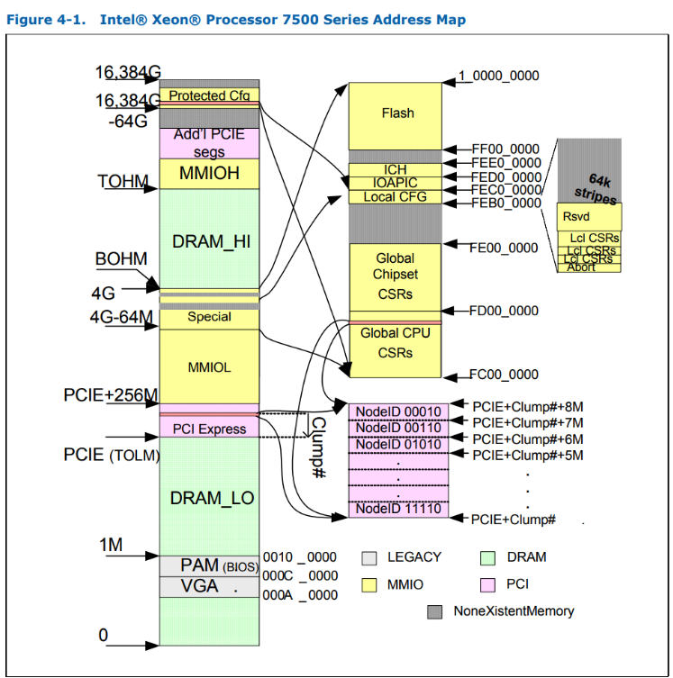

## RISC-V CPU reset

主板上电后，CPU进行reset，初始化寄存器的状态。

> 3.4  Reset
>
> Upon reset, a hart’s privilege mode is set to M. The mstatus fields MIE and MPRV are reset to 0. If little-endian memory accesses are supported, the mstatus/mstatush field MBE is reset to 0. The misa register is reset to enable the maximal set of supported extensions and widest MXLEN, as described in Section 3.1.1. For implementations with the “A” standard extension, there is no valid load reservation. **The pc is set to an implementation-defined reset vector.** The mcause register is set to a value indicating the cause of the reset. Writable PMP registers’ A and L fields are set to 0, unless the platform mandates a different reset value for some PMP registers’ A and L fields. 

众多寄存器中，我们暂时只追踪`pc`的值，文档中说`pc`寄存器的初始值是由实现定义的，因此需要看`qemu-riscv`的实现。

> https://github.com/slavaim/riscv-notes/blob/master/bbl/boot.md

`qemu-riscv`的实现中，cpu reset后`pc`寄存器的值被初始化为`DEFAULT_RSTVEC = 0x00001000`，这个地址正是`boot ROM`的位置。

> The 0x00001000 address is mapped to ROM with a trampoline code to 0x80000000. `AUIPC` instruction moves its immediate value 12 bits to the left and adds to the current PC , so `t0 = 0(x7ffff<<12)+ 0x1000 = 0x80000000`

```assembly
(gdb) x/2i 0x1000
   0x1000:	auipc	t0,0x7ffff
   0x1004:	jr	t0
```

经过`boot rom`的跳转，`pc`变成了`0x80000000`，正是DRAM被映射的位置，加载程序将xv6内核（二进制文件kernel/kernel，260K大小，OS所需要的所有子部分被链接成一个文件，即这个内核文件）加载到物理地址为`0x80000000`的内存地址。

此时，CPU真正开始去执行操作系统的代码，xv6从`entry.S`开始OS的第一行代码。


而真实世界中的流程要复杂的多，从reset到把控制权交给OS，要经过众多流程，下图是一个简要说明。

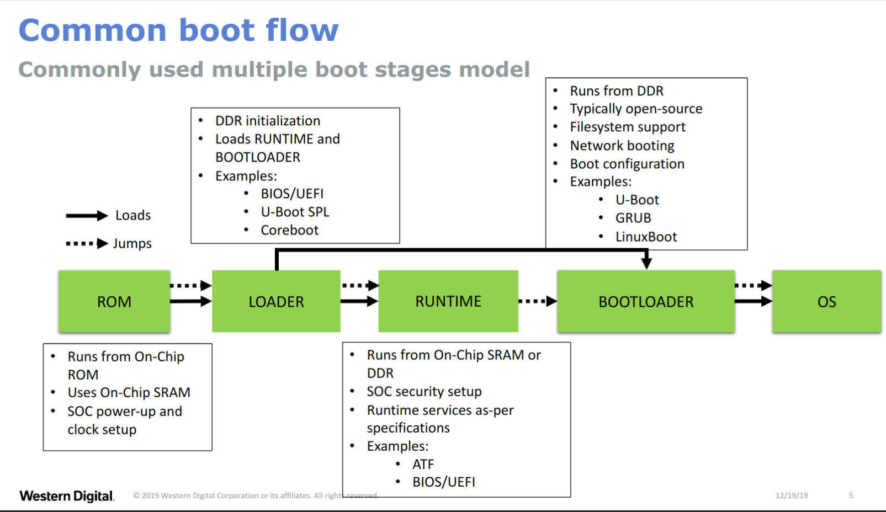


## RISC-V Assembly

> https://github.com/riscv-non-isa/riscv-asm-manual/blob/master/riscv-asm.md

RISC-V  GPRs(General purpose Registers)有32个，使用中我们大多使用他们的ABI Name。

此外，RISC-V架构定义了一些控制和状态寄存器（Control and Status Register，CSR），用于配置或记录一些运行的状态。CSR寄存器是处理器核内部的寄存器，使用其自己的地址编码空间和存储器寻址的地址区间完全无关系。

CSR寄存器的访问采用专用的CSR指令，包括CSRRW、CSRRS、CSRRC、CSRRWI、CSRRSI以及CSRRCI指令。


- 在硬件中还有一个寄存器叫做程序计数器（Program Counter Register）。
- 还有一堆控制CPU工作方式的寄存器，比如SATP（Supervisor Address Translation and Protection）寄存器，它包含了指向page table的物理内存地址。
- 还有一些对于今天讨论非常重要的寄存器，比如STVEC（Supervisor Trap Vector Base Address Register）寄存器，它指向了内核中处理trap的指令的起始地址。
- SEPC（Supervisor Exception Program Counter）寄存器，在trap的过程中保存程序计数器的值。
- SSRATCH（Supervisor Scratch Register）寄存器，这也是个非常重要的寄存器。
- 。。。


常见指令与伪指令，

- `lui` (Load Upper Immediate): this sets `rd` to a 32-bit value with the low 12 bits being 0 and the high 20 bits coming from the U-type immediate.
- `auipc` (Add Upper Immediate to Program Counter): this sets `rd` to the sum of the current PC and a 32-bit value with the low 12 bits as 0 and the high 20 bits coming from the U-type immediate.
- `li` pseudo instruction which is used to load immediate values.
- `la` pseudo instruction which is used to load symbol addresses.
- `l{b|h|w|d} <rd>, <symbol>`: load byte, half word, word or double word from global[1](https://github.com/riscv-non-isa/riscv-asm-manual/blob/master/riscv-asm.md#user-content-fn-1-01256c097a7da134ba4871d07fea9378)
- `s{b|h|w|d} <rd>, <symbol>, <rt>`: store byte, half word, word or double word to global[2](https://github.com/riscv-non-isa/riscv-asm-manual/blob/master/riscv-asm.md#user-content-fn-2-01256c097a7da134ba4871d07fea9378)
- `call <symbol>`: call away subroutine[3](https://github.com/riscv-non-isa/riscv-asm-manual/blob/master/riscv-asm.md#user-content-fn-3-01256c097a7da134ba4871d07fea9378)
- `call <rd>, <symbol>`: call away subroutine[4](https://github.com/riscv-non-isa/riscv-asm-manual/blob/master/riscv-asm.md#user-content-fn-4-01256c097a7da134ba4871d07fea9378)
  - similar to `call <symbol>`, but `<rd>` is used to save the return address instead. 
- `jump <symbol>, <rt>`: jump to away routine[6](https://github.com/riscv-non-isa/riscv-asm-manual/blob/master/riscv-asm.md#user-content-fn-6-01256c097a7da134ba4871d07fea9378)
- `jal` : jump to address and place return address in GPR.
- `jr` : jump to address
- `jalr`: jump to address and place return address in GPR.
  - the `JALR` instruction ignores the lowest bit of the calculated target address.
- ...

## RISC-V Privilege modes

RISC-V架构定义了四种工作模式，又称特权模式（Privileged Mode）：

- Machine Mode：机器模式，简称M Mode。
- Supervisor Mode：监督模式，简称S Mode。
- User Mode：用户模式，简称U Mode。
- Debug Mode：由实现定义，Debug mode (D-mode) can be considered an additional privilege mode, with even more access than M-mode.

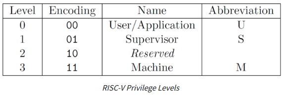


M,S模式都有对应的CSR寄存器，如`mepc` `sepc` ...


RISC-V支持machine/supervisor/user mode.

而以OS视角，仅分为kernel/user mode.


系统启动时跑在machine mode，然后进入supervisor mode，user mode，此后有中断时，又从user mode 进入 supervisor mode，可以理解为OS视角的kernel mode对应着supervisor mode.


## RISC-V CSRs(Control and Status Registers)

> https://five-embeddev.com/riscv-isa-manual/latest/machine.html#machine-level-csrs
>
> https://balancetwk.github.io/2020/12/05/hexo-blog/RISC_V_Note/RISC-V%20%E7%89%B9%E6%9D%83%E6%A8%A1%E5%BC%8F%EF%BC%9A%E6%9C%BA%E5%99%A8%E6%A8%A1%E5%BC%8F/

CSR控制着当前系统的状态，包括是否开中断，设置页表，设置特权模式等等。


e.g.

- `stvec`：内核在这里写入其陷阱处理程序的地址；RISC-V跳转到这里处理陷阱。
- `sepc`：当发生陷阱时，RISC-V会在这里保存程序计数器`pc`（因为`pc`会被`stvec`覆盖）。`sret`（从陷阱返回）指令会将`sepc`复制到`pc`。内核可以写入`sepc`来控制`sret`的去向。
- `scause`： RISC-V在这里放置一个描述陷阱原因的数字。
- `sscratch`：内核在这里放置了一个值，这个值在陷阱处理程序一开始就会派上用场。
  - Typically, `sscratch` is used to hold a pointer to the hart-local supervisor context while the hart is executing user code. At the beginning of a trap handler, ` sscratch` is swapped with a user register to provide an initial working register.
- `sstatus`：其中的**SIE**位控制设备中断是否启用。如果内核清空**SIE**，RISC-V将推迟设备中断，直到内核重新设置**SIE**。**SPP**位指示陷阱是来自用户模式还是管理模式，并控制`sret`返回的模式。
- ...


### `m/s status`


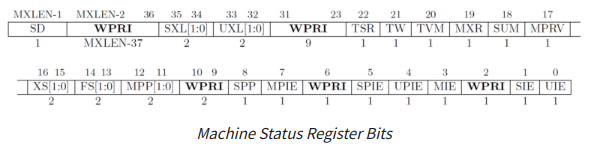

从 machine mode 到 supervisor mode：

1. 设置mstatus寄存器的`mpp`字段为`0b01`（代表S mode）
2. 设置好mepc寄存器
3. 执行mret，pc变成mepc中的值


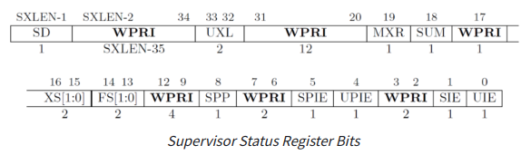


从 supervisor mode 到 user mode：

1. 设置sstatus寄存器的`spp`字段为`0b0`（代表U mode）
2. 设置好sepc寄存器
3. 执行sret

### `satp`

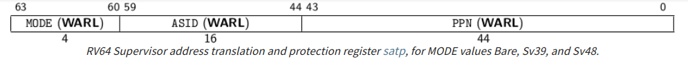

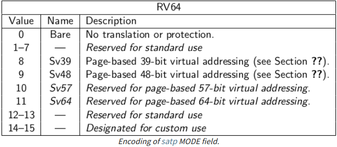

想要禁用页表地址翻译，需要将mode字段赋值0.

 *xv6*运行在*Sv39* RISC-V上，因此要使用页表，mode字段赋值8.

### `medeleg` / `mideleg`

> The machine exception delegation register (`medeleg`) and machine interrupt delegation register (` mideleg`) are MXLEN-bit read/write registers.


RISC-V 有两个寄存器 medeleg 和 mideleg ，分别用于委托异常和中断。

默认情况下，任何特权级别的所有陷阱都在机器模式下处理，但是在机器模式的异常服务程序里可以通过 MRET 指令将陷阱重定向回我们想要的特权模式。

为了提高性能，可以在 medeleg 和 mideleg 对单个位的写入来指定特定的异常和中断应该由 RISC-V 那种特权模式来处理。（通常就是 M 模式委托给 S 模式）


XV6将所有中断/异常处理都交给S mode，因此这两寄存器的每一位全赋值1.

### `sip` /`sie`

> The `sip` register is an SXLEN-bit read/write register containing information on pending interrupts, while `sie` is the corresponding SXLEN-bit read/write register containing interrupt enable bits. 

`sie`寄存器控制着对应中断是否启用。


### `pmpaddr`/ `pmpcfg`

> PMP entries are described by an 8-bit configuration register and one MXLEN-bit address register.
>
> PMP CSRs are only accessible to M-mode.


一个PMP configuration register（8bits）+ PMP address register（64bits）组成一个PMP entry.


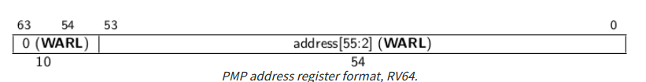

For RV64, each PMP address register encodes bits 55–2 of a 56-bit physical address, as shown in Figure [1.27](https://five-embeddev.com/riscv-isa-manual/latest/machine.html#pmpaddr-rv64).  因此，编程时需要将`address >> 2` 在放入 pmpaddr 中。


`PMP configuration register`仅占8位，因此8个一组，放到一个pmpcfg寄存器里。

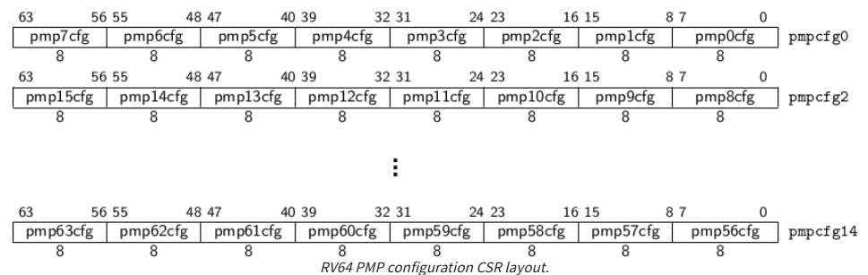

> *RV64 systems use* *`pmpcfg2`**, rather than* *`pmpcfg1`**, to hold configurations for PMP entries 8–15. This design reduces the cost of supporting multiple MXLEN values, since the configurations for PMP entries 8–11 appear in* *`pmpcfg2`**[31:0] for both RV32 and RV64.*


PMP configuration register 格式如下。

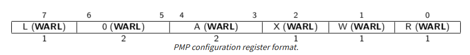

The R, W, and X bits, when set, indicate that the PMP entry permits **read, write, and instruction execution**, respectively. When one of these bits is clear, the corresponding access type is denied.


**A bit**表示如何解读对应的PMP address register.

> The A field in a PMP entry’s configuration register encodes the address-matching mode of the associated PMP address register. 


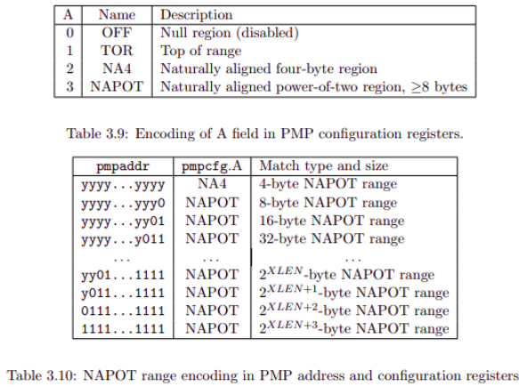


- TOR：如果 pmpcfg[i] 的 A 設成 TOR => 表示規範 pmpaddr[i - 1] <= addr < pmpaddr[i], 如果 i == 0 則規範 0<= addr < pmpaddr0 的範圍。
- NAPOT：设从低位向高位方向，连续个1的个数为$N$. 则range为 $2^3 \times 2^N$ Bytes. 而 base 是从将连续的 1 都转为 0 的地方。（有点像子网掩码的感觉）
  - e.g. yyyy … y011 => base = yyyy … yy000, range = $2^3 \times 2^2 = 32$ B => 表示地址范围是从`yyyy … yy000`开始的32个字节。
- NA4：表示从 `yyyy…yyyy` 開始的 4 bytes


**L bit**用來規範符合 Range 的 (R/W/X) 操作，L bit 被設起來後，這個 pmpcfg 就被鎖住，任何對這個 entry(pmpcfg + pmpaddr) 的寫入都會被忽略，直到下一次 reset。另外如果 L 被設起來連在 M-mode 下都要遵守 pmpcfg 的 (R/W/X) 權限，如果 L 為 0, 則 M-mode 可以自由寫入但 S/U mode 依然要遵行 (R/W/X) 的設定。


此外，pmp entries 有優先權的，number 越小的優先權越高，如果 access 符合 entry0 (pmpcfg0 + pmpaddr0) 的範圍，則該 entry 的設定（RWX）可以決定 access 的成功與否，而每一次 access 都要符合 pmp entry 的範圍，如果不符合直接 access fail 不管(L/R/W/X)。

如果所 access 的地址沒有被**任何 pmp entry** 規範到，只有在 M mode 下 access 會成功，S/U mode 下都會失敗。

這裡要注意到：只要有一個 pmp entry 被 programed，所有 entry 都會被視為有效(A 預設為 OFF)。

> https://hackmd.io/@kaY0TZGmReqh1uwlnjZV8w/BJHBqY0oL


### `mhartid`

表示当前执行代码的hart ID. Hart IDs编号不一定连续，但保证有一个编号为0，且互不相同.


### `mtime` / `mtimecmp`

- `mtime`: a 64-bit memory-mapped machine-mode read-write register
- `mtimecmp`: a 64-bit memory-mapped machine-mode timer compare register 


A timer interrupt becomes pending whenever `mtime` contains a value greater than or equal to `mtimecmp`, treating the values as unsigned integers. The interrupt remains posted until `mtimecmp` becomes greater than `mtime` (typically as a result of writing `mtimecmp`).

The interrupt will only be taken if interrupts are enabled and the MTIE bit is set in the `mie` register.


这俩memory-mapped寄存器的地址是由平台定义的。

而`qume-riscv  -machine virt`实现文档就没有，只能去翻代码😭。

- [时钟频率 为 10000000](https://github.com/qemu/qemu/blob/e46e2628e9fcce39e7ae28ac8c24bcc643ac48eb/include/hw/intc/riscv_aclint.h#L78)

- [CLINT 地址为 0x2000000](https://github.com/qemu/qemu/blob/42e1e350bffc8d4614e568a03380b2ec34a131bf/hw/riscv/virt.c#L80)

- 姑且任务`qemu-riscv -machine virt` [用的是SiFive CLINT，那么](https://github.com/qemu/qemu/blob/e46e2628e9fcce39e7ae28ac8c24bcc643ac48eb/hw/riscv/virt.c#L1407)

- ```c
  #define RISCV_MTIMECMP_ADDR (0x2000000 + 0x4000)
  #define RISCV_MTIME_ADDR    (0x2000000 + 0x4000 + 0x7FF8)
  ```


## `entry.S` -> `start.c` -> `main.c`

xv6操作系统从`entry.S`开始拿到CPU控制权，到最终`main.c`里执行完初始化，跑起shell结束，算是完成了os的启动。


### `entry.S`

**Run in Machine Mode**


xv6定义了`NCPU=8` 核心处理器，每个核心(risc-v称之为hart[hardware thread])都并行的执行，都从`Boot Rom`跳转到`entry.S`

此时，只能还只能执行汇编代码，我们还没有为每个CPU开辟stack，因此暂时不能执行C代码。


为每个核心设置好对应`sp`寄存器（即设置好stack），就可以跳转到`start.c`去执行C代码了。


注意，RISC-V要求stack地址向下增长，并且`sp`始终对齐到16字节。

>  In the standard RISC-V calling convention, the stack grows downward and the stack pointer is always kept 16-byte aligned.
>
> From RISC-V Calling Convention

因此，`start.c`中的栈空间（实际就是个大数组）定义如下

`__attribute__ ((aligned (16))) char stack0[4096 * NCPU];`

每个核心有4KB大的执行栈。


至于，这个栈在内存中的真正地址是由编译器决定的，内核被加载到`0x80000000`地址，栈一定在这个地址之后，我这里是在`80008890 <_GLOBAL_OFFSET_TABLE_+0x8>`地址，它的真正地址并不需要关心。


```assembly
_entry:
        # set up a stack for C.
        # stack0 is declared in start.c,
        # with a 4096-byte stack per CPU.
        # sp = stack0 + (hartid * 4096)
        la sp, stack0 # load address of stack0 to sp register
        li a0, 1024*4 # per hart has 4kB space of stack.
        csrr a1, mhartid # get current hart id to a1
        addi a1, a1, 1 # the stack grows downward, so `sp` of hart0 is stack0 + 4096*(0+1)
        mul a0, a0, a1
        add sp, sp, a0 # sp of hart0 is stack0 + 4096*1 , of hart1 is stack0 + 4096*2
        # jump to start() in start.c
        call start # Entry C language world, say bye to assembly
```


总而言之，`entry.S`做了一件事就是设置执行栈空间，以执行C代码。


### `start.c`

**Run in Machine Mode**

1. 设置MSTATUS的MPP位
2. 设置MEPC为`main`地址
3. 暂时禁用页表翻译
4. 设置PMP(Physical Memory Protection)
5. 初始化时钟中断
   1. 中断部分最复杂了😭


总而言之，设置CSRs，为进入S-Mode做好准备。


### `main.c`

**Run in Supervisor Mode**

所有hart都会运行到这，但只有hart0去执行各部件的初始化。

```c
  if(cpuid() == 0){
    consoleinit();
    printfinit();
    printf("\n");
    printf("xv6 kernel is booting\n");
    printf("\n");
    kinit();         // physical page allocator
    kvminit();       // create kernel page table
    kvminithart();   // turn on paging
    procinit();      // process table
    trapinit();      // trap vectors
    trapinithart();  // install kernel trap vector
    plicinit();      // set up interrupt controller
    plicinithart();  // ask PLIC for device interrupts
    binit();         // buffer cache
    iinit();         // inode table
    fileinit();      // file table
    virtio_disk_init(); // emulated hard disk
    userinit();      // first user process
    __sync_synchronize(); // It is a atomic builtin for full memory barrier.
    // No memory operand will be moved across the operation, either forward or backward. Further, instructions will be issued as necessary to prevent the processor from speculating loads across the operation and from queuing stores after the operation.
    started = 1;
  } else {
    while(started == 0)
      ;
    __sync_synchronize();
    printf("hart %d starting\n", cpuid());
    kvminithart();    // turn on paging
    trapinithart();   // install kernel trap vector
    plicinithart();   // ask PLIC for device interrupts
  }
```


