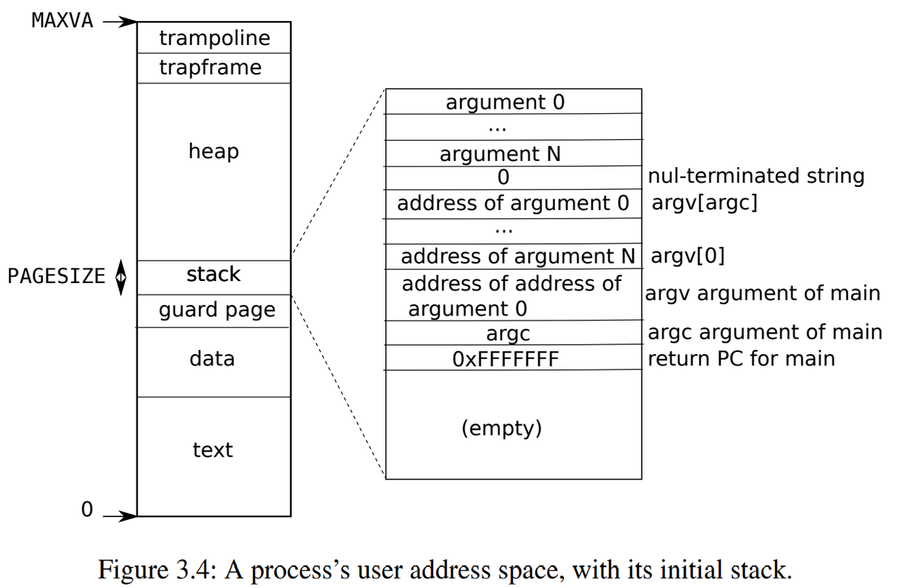

#! https://zhuanlan.zhihu.com/p/573391724
# S2 - Address Spaces and Page Table

为了使各个进程相互隔离，互不影响，操作系统要使用一种机制，使得每个进程认为好像自己在独占整个内存，这种机制就是页表（Page Table）。

这就是OSTEP里提到的虚拟化的体现。

## Address Spaces

内核的地址空间如下图。内核使用“直接映射”获取内存和内存映射设备寄存器；也就是说，将资源映射到等于物理地址的虚拟地址。

有几个内核虚拟地址不是直接映射：

- 蹦床页面(trampoline page)。它映射在虚拟地址空间的顶部；用户页表具有相同的映射。第4章讨论了蹦床页面的作用，但我们在这里看到了一个有趣的页表用例；一个物理页面（持有蹦床代码）在内核的虚拟地址空间中映射了两次：一次在虚拟地址空间的顶部，一次直接映射。
- 内核栈页面。每个进程都有自己的内核栈，它将映射到偏高一些的地址，这样xv6在它之下就可以留下一个未映射的保护页(guard page)。保护页的PTE是无效的（也就是说`PTE_V`没有设置），所以如果内核溢出内核栈就会引发一个异常，内核触发`panic`。如果没有保护页，栈溢出将会覆盖其他内核内存，引发错误操作。恐慌崩溃（panic crash）是更可取的方案。*（注：Guard page不会浪费物理内存，它只是占据了虚拟地址空间的一段靠后的地址，但并不映射到物理地址空间。）*

用户进程的地址空间如下图，进程的地址空间是连续的，但实际映射到内存里，并不一定是连续的（xv6中分配以page[4Kb]为最小单位，page内是连续的，page间不确定）。用户进程在内存中的实际位置在上图中的`Free  memory`部分。

- text：also known as a code segment。存放编译后二进制代码。
- data：全局变量以及static变量
- guard page：用来防止栈溢出。这个段不会被映射到物理地址，对这个段进行读写会导致异常。
- stack：固定大小的用户栈空间，向下增长
- heap：expandable heap，malloc就在管理这片内存
- trapframe：用来保存必要的寄存器，以在user/kernel mode之间进行切换，每个进程都有单独的一个。
- trampoline：处理trap的代码位置

## Page Table

我们如何能够实现地址空间呢？或者说如何在一个物理内存上，创建不同的地址空间？

最常见的方法，同时也是非常灵活的一种方法就是使用页表（Page Tables）。

页表是在硬件中通过处理器和MMU（Memory Management Unit）实现。MMU是硬件的一部分而不是操作系统的一部分。

假设CPU正在执行指令，例如 ` sd $7, (a0) ` 。对于任何一条带有地址的指令，其中的地址应该认为是虚拟内存地址而不是物理地址。假设寄存器a0中是地址0x1000，那么这是一个虚拟内存地址。

虚拟内存地址会被转到内存管理单元（MMU，Memory Management Unit）。内存管理单元会将虚拟地址翻译成物理地址。

从CPU的角度来说，一旦MMU打开了，它执行的每条指令中的地址都是虚拟内存地址。

为了能够完成虚拟内存地址到物理内存地址的翻译，MMU会有一个表单，表单中，一边是虚拟内存地址，另一边是物理内存地址。

通常来说，内存地址对应关系的表单也保存在内存中。所以CPU中需要有一些寄存器用来存放表单在物理内存中的地址。现在，在内存的某个位置保存了地址关系表单，我们假设这个位置的物理内存地址是0x10。那么在RISC-V上一个叫做**SATP**的寄存器会保存地址0x10。

MMU并不会保存page table，page table保存在内存中，MMU只是会去查看page table完成翻译。

每个进程都有内存中有他自己的page table，这个分配是由操作系统完成的，因此在进程切换时**SATP**寄存器也会被更改。

### RISC-V Page Table

- V：PTE是否有效，当为0时PTE无效，剩余的其他bits无意义，可以被随意使用。
- RWX：readable, writable,  executable
  - 当三个bits都是0时，该PTE指向下一层page table。否则，该PTE为叶节点。
- U：在User mode下是否可以访问该page。U=1，U-mode下可以访问。
  - 此外，该标志位也对S-mode存在限制。
  - 当`sstatus`寄存器中的`SUM (permit Supervisor User Memory access)`字段为1时，S-mode下可以读写 U = 1 的page。否则不行。（U=0 的page，S-mode随意访问）。
  - 无论如何，S-mode下不能执行U = 1 page 中的代码。
- G：全局映射标志
  - 对于非叶 PTE，全局设置意味着页表后续级别中的所有映射都是全局的。
  - 请注意，未能将全局映射标记为全局映射只会降低性能，而将非全局映射标记为全局映射是一个软件错误。
- A：The A bit indicates the virtual page has been read, written, or fetched from since the last time the A bit was cleared. 
- D：The D bit indicates the virtual page has been written since the last time the D bit was cleared.
- For **non-leaf** PTEs, the D, A, and U bits are reserved for future standard use and **must be cleared** by software for forward compatibility.

XV6使用Sv39 RISC-V，也就是64位地址中前25位不使用(必须全赋值0)，仅使用后39位作为地址。

RISC-V内存管理的最小单位是$ 2^{12} = 4KB $，也就是1 page.

页表以三级的树型结构存储在物理内存中。每个Page Directory大小4KB，每个PTE（Page Table Entry）占64bits ，一个Page Directory中包含512个PTE。

如图所示，实际的转换分三个步骤进行。注意，3级 page table的查找都发生在硬件中。

该树的根是一个4KB的Page Directory，其中包含512个PTE，每个PTE中包含该树下一级页表页的物理地址。

这些页中的每一个PTE都包含该树最后一级的512个PTE（也就是说每个PTE占8个字节，正如图3.2最下面所描绘的）。

分页硬件使用27位中的前9位在根页表页面中选择PTE，中间9位在树的下一级页表页面中选择PTE，最后9位选择最终的PTE。

整个过程就和EXT文件系统里的inode的block指针类似。

三级结构的优点就是更加节省内存，可以按需分配页面。举个例子，如果一个应用程序只使用了一个页面，那么顶级页面目录将只使用条目0，条目 1 到 511 都将被忽略，因此内核不必为这511个条目所对应的中间页面目录分配页面，也就更不必为这 511 个中间页目录分配底层页目录的页。

缺点是 CPU 必须从内存中加载三个 PTE 以将虚拟地址转换为物理地址。为了减少从物理内存加载 PTE 的开销，RISC-V CPU 将页表条目缓存在 Translation Look-aside Buffer (TLB) 中。

最后，Page Table十分灵活，不仅可以实现进程的地址空间隔离，也可以配合Page Fault异常实现许多高级的功能，比如COW（Copy on write），mmap（memory mapped files）等等

### TLB（Translation Lookaside Buffer）

你可以发现，当处理器从内存加载或者存储数据时，基本上都要做3次内存查找，第一次在最高级的page directory，第二次在中间级的page directory，最后一次在最低级的page directory。所以对于一个虚拟内存地址的寻址，需要读三次内存，这里代价有点高。所以实际中，几乎所有的处理器都会对于最近使用过的虚拟地址的翻译结果有缓存。这个缓存被称为：Translation Lookside Buffer（通常翻译成页表缓存）。你会经常看到它的缩写TLB。基本上来说，这就是Page Table Entry的缓存，也就是PTE的缓存。

当处理器第一次查找一个虚拟地址时，硬件通过3级page table得到最终的PPN，TLB会保存虚拟地址到物理地址的映射关系。这样下一次当你访问同一个虚拟地址时，处理器可以查看TLB，TLB会直接返回物理地址，而不需要通过page table得到结果。

注意：如果你切换了page table，操作系统需要告诉处理器当前正在切换page table，处理器会清空TLB。因为本质上来说，如果你切换了page table，TLB中的缓存将不再有用，它们需要被清空，否则地址翻译可能会出错。所以操作系统知道TLB是存在的，但只会时不时的告诉操作系统，现在的TLB不能用了，因为要切换page table了。在RISC-V中，清空TLB的指令是`sfence_vma`。

