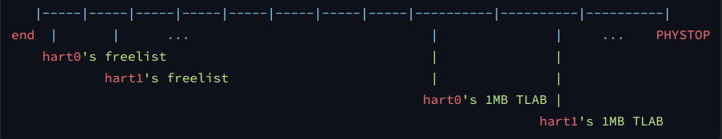
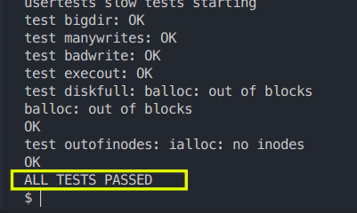

#! https://zhuanlan.zhihu.com/p/573753667
# S3 - Kernel Memory Allocation

> http://xv6.dgs.zone/tranlate_books/book-riscv-rev1/c3/s5.html
>


本文介绍XV6的kalloc内存分配方法，并使用TLAB思想改进kalloc。


## XV6的物理内存分配

内核必须在运行时为页表、用户内存、内核栈和管道缓冲区分配和释放物理内存。

xv6使用内核末尾到`PHYSTOP`之间的物理内存进行运行时分配。它一次分配和释放整个4096字节的页面。

它使用链表的数据结构将空闲页面记录下来。分配时需要从链表中删除页面；释放时需要将释放的页面添加到链表中。

XV6共拥有128MB的内存，内存地址从`0x80000000`开始，到`0x88000000`结束。

- `0x80000000`-`0x80021d60` ，内核程序本身占用这段内存
- `0x80021d60`-`0x88000000`，Free memory 由内核管理（kalloc,kfree），以按需分配
  - `0x80021d60` - `0x80022000`，没有使用，原因`PGROUNDUP(0x80021d60) == 0x80022000`
  - `0x80022000`  - `0x88000000`，真正被管理的内存空间，32734个4KB的页面。


XV6分配，释放内存都以4KB为单位，`kalloc(void)`是不要参数的。因此内存都要对4K对齐。代码如下。

```c
#define PGSIZE 4096 // bytes per page

#define PGROUNDUP(sz)  (((sz)+PGSIZE-1) & ~(PGSIZE-1))
#define PGROUNDDOWN(a) (((a)) & ~(PGSIZE-1))
```

使用`uint16_t`举例说明

```C
PGSIZE      0b0001000000000000
PGSIZE-1    0b0000111111111111
~(PGSIZE-1) 0b1111000000000000
------------------------------
a           0b0010101001010101
a+PGSIZE-1  0b0011101001010100
RU(a)       0b0011000000000000
RD(a)       0b0010000000000000
```


XV6使用free-list链表管理内存，经过初始化，链表里有32734个页面。`kalloc`时取出链表头那个，`kfree`再插入链表头。

因为分配都是固定大小，因此也无所谓什么firsrt fit,best fit等等

所有hart都使用同一个free-list管理内存，因此需要一把大锁来构建临界区。


## 改进XV6的`kalloc`

> 如果数据结构选择得不太差，**性能瓶颈就主要在于多个线程并发访问时的互斥**，由于多个线程都需要获得同一把锁，就会出现 “一核出力、他人围观” 的情况。
>
> 正如课本上所说，现代 malloc/free 实现的主要思想就是区分 fast/slow path，使得 fast path 分配在线程本地完成，从而不会造成锁的争抢。你也可以为每个 CPU 分配页面的缓存——可以借鉴 slab，也可以预先把页面分配给 CPU，在内存不足时再上锁从其他 CPU “偷取” 页面。
>
> https://jyywiki.cn/OS/2022/labs/L1


接下来我们将改进XV6的kalloc。


> https://jyywiki.cn/OS/2022/slides/14.slides#/5/1

使所有 CPU 都能并行地申请内存

- 线程都事先瓜分一些 “领地” (thread-local allocation buffer)
- 默认从自己的领地里分配
  - 除了在另一个 CPU 释放，acquire lock 几乎总是成功
- 如果自己的领地不足，就从全局的池子里借一点


内存管理继续使用free-list，因为XV6的`kalloc`有一个很重要的特点是它只分配4KB的内存。使用别的，比如Buddy Allocation都会带来额外的开销，完全没有必要。


我们预先为每个hart分配1MB内存，使用free-list进行管理。内存布局如下。




编译后执行`usertests`，截图如下




代码也很短，只多加100多行，见下面的链接。

https://github.com/Delta-in-hub/xv6-riscv-with-comments/blob/724445e02a5b4f5af1798c051f144f09af4c8447/kernel/kalloc.c#L101


