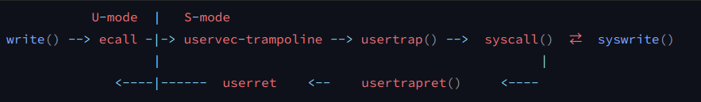

#! https://zhuanlan.zhihu.com/p/574220420


# S4 - Trap and System call


有三种事件会导致中央处理器搁置普通指令的执行，并强制将控制权转移到处理该事件的特殊代码上。

- 系统调用：当用户程序执行`ecall`指令
- 异常：（用户或内核）指令做了一些非法的事情，例如除以零或使用无效的虚拟地址
- 设备中断：一个设备触发了中断使得当前程序运行需要响应内核设备驱动

本书使用陷阱（trap）作为这些情况的通用术语。


当处于用户态时，trap会跳到S-mode。当处于S-mode时，trap会跳到M-mode或依然留在S-mode。


## Trap机制


关于Trap，我们有几个基本的目标

- 安全和隔离：我们不想让用户代码介入到这里的user/kernel切换，否则有可能会破坏安全性。所以这意味着，trap中涉及到的硬件和内核机制不能依赖任何来自用户空间东西。
- 对用户透明：我们希望内核能够响应中断，之后在用户程序完全无感知的情况下再恢复用户代码的执行。


因此，我们至少要做：

- 需要保存32个用户寄存器。因为寄存器表明程序执行的状态。但是这些寄存器又要被内核代码所使用，所以在trap之前，你必须**先在某处保存这32个用户寄存器**。
- **程序计数器`PC`也需要在某个地方保存**，它几乎跟一个用户寄存器的地位是一样的，我们需要能够在用户程序运行中断的位置继续执行用户程序。
- 需要将mode改成supervisor mode，因为我们想要使用内核中的各种各样的特权指令。
- `SATP`寄存器现在正指向user page table，而user page table只包含了用户程序所需要的内存映射和一两个其他的映射，它并没有包含整个内核数据的内存映射。所以在运行内核代码之前，我们需要将`SATP`寄存器指向kernel page table。
- 需要将栈寄存器`sp`指向位于内核的一个地址，因为我们需要一个栈来调用内核的C函数（所谓的内核栈）。


Trap之后，系统进入S-mode（内核态），与用户态相比，进入内核态后能做的事：

- 可以读写控制寄存器了。比如说，当你在supervisor mode时，你可以：读写SATP寄存器，也就是page table的指针；STVEC，也就是处理trap的内核指令地址；SEPC，保存当发生trap时的程序计数器；SSCRATCH等等。在supervisor mode你可以读写这些寄存器，而用户代码不能做这样的操作。
- S-mode下可以使用PTE_U标志位为0的PTE。当PTE_U标志位为1的时候，表明用户代码可以使用这个页表；如果这个标志位为0，则只有supervisor mode可以使用这个页表。
- 需要特别指出的是，supervisor mode中的代码并不能读写任意物理地址。
  - 在supervisor mode中，就像普通的用户代码一样，也需要通过page table来访问内存。如果一个虚拟地址并不在当前由SATP指向的page table中，又或者SATP指向的page table中PTE_U=1，那么supervisor mode不能使用那个地址。所以，即使我们在supervisor mode，我们还是受限于当前page table设置的虚拟地址。*[是由`sstatus`寄存器中的`SUM (permit Supervisor User Memory access)`字段和`PTE_U`字段共同控制，具体见文章 S2 - Address Spaces and Page Table ]*


## System call

接下来，我们以在用户态执行`write（）`系统调用为例，说明整个trap的过程。


调用流程图如下（注：有（）的是C代码，没有的是汇编）：



#### 

首先，我们在用户态编写如下的C代码（比如`sh.c`中）

```c
write(_fd,_ptr,5);
```

接着由编译器翻译成汇编代码

```assembly
# 省略了构造参数的过程

li	a7,16  # SYS_write == 16
ecall
```

每一个系统调用都有一个调用号，定义在`kernel/syscall.h`中，把这个号存在`a7`寄存器中（calling convention），然后调用`ecall`指令（`ecall`是一条硬件指令，而不是一个函数）。


我们编译用户程序使用的是`riscv64-linux-gnu-gcc`，可`gcc`是如何知道我们自己定义的系统调用号的呢？

这个问题可以在`Makefile`里找到答案。


### `libc`  of xv6

> https://linux.die.net/man/7/libc
>
> glibc是linux系统中最底层的api，几乎其它任何运行库都会依赖于glibc。glibc除了封装linux操作系统所提供的系统服务外，它本身也提供了许多其它一些必要功能服务的实现。
>
> 
>
> 接下来的过程，其实就是在构建xv6上的libc


`Makefile`如下

```makefile
ULIB = $U/ulib.o $U/usys.o $U/printf.o $U/umalloc.o

_%: %.o $(ULIB)
	$(LD) $(LDFLAGS) -T $U/user.ld -o $@ $^   	#step 3

$U/usys.S : $U/usys.pl
	perl $U/usys.pl > $U/usys.S					#step 1

$U/usys.o : $U/usys.S
	$(CC) $(CFLAGS) -c -o $U/usys.o $U/usys.S   #step 2
```


以编译`cat`为例

```bash
perl user/usys.pl > user/usys.S

riscv64-linux-gnu-gcc -c -o user/usys.o user/usys.S

riscv64-linux-gnu-ld -o user/_cat user/cat.o user/ulib.o user/usys.o user/printf.o user/umalloc.o
```

首先使用`perl`从`usys.pl`生成汇编代码`usys.S`，你可以理解为`perl`根据规则，自动生成了一些字符串。


生成的`usys.S`如下，注意第一行，这就是`gcc`知道`SYS_write == 16`的原因

```assembly
#include "kernel/syscall.h"

...

.global write
write:
 li a7, SYS_write
 ecall
 ret
```

接着用`gcc`生成`usys.o`，之后每个用户程序都会链接上这个`usys.o`。

由此生成的二进制文件，就可以在我们的xv6上运行了。


其实这一整个过程就是在构建xv6上的libc。 *libc除了封装linux操作系统所提供的系统服务外，它本身也提供了许多其它一些必要功能服务的实现*。libc里只是对系统调用进行C语言的封装，ta并不关心syscall具体是如何实现的。


回到主题，将`SYS_write`放到`a7`寄存器后，便执行了`ecall`，执行完便进入了S-mode。

### `ecall`

> **ecall**(environment call)，当我们在 S 态执行这条指令时，会触发一个 ecall-from-s-mode-exception，从而进入 M 模式中的中断处理流程（如设置定时器等）；当我们在 U 态执行这条指令时，会触发一个 ecall-from-u-mode-exception，从而进入 S 模式中的中断处理流程（常用来进行系统调用）。


RISC-V硬件对所有陷阱类型（计时器中断除外）执行以下操作：

1. 如果陷阱是设备中断，并且状态**SIE**位被清空，则不执行以下任何操作。
2. 清除**SIE**以禁用中断。
3. 将`pc`复制到`sepc`。
4. 将当前模式（U-mode或S-mode）保存在状态的**SPP**位中。
5. 设置`scause`以反映产生陷阱的原因。
6. 将模式设置为S-mode。
7. 将`stvec`复制到`pc`。
8. 在新的`pc`上开始执行。


简单说`ecall`做了这几件事

- 从U-mode进入S-mode
- 关中断
- 把`pc`存到`sepc`寄存器
- 把`stvec`的值给`pc`寄存器

除此之外，`ecall`没做任何事情，没有切换page table，没有保存/修改其他寄存器。

也正是因为`ecall`没有切换page table，但改变了`pc`寄存器，因此想要能继续正确执行代码，代码的地址就必须在用户的地址空间被映射了。这就是为什么用户地址空间顶部要映射`trampoline`的原因。

> 所以这意味着，trap处理代码必须存在于每一个user page table中。因为ecall并不会切换page table，我们需要在user page table中的某个地方来执行最初的内核代码。而这个trampoline page，是由内核小心的映射到每一个user page table中，以使得当我们仍然在使用user page table时，内核在一个地方能够执行trap机制的最开始的一些指令。


执行完 ecall后，`pc`寄存器为`0x3ffffff000`，也就是在trampoline page的最开始。我们现在正在trampoline page中执行程序，这个page包含了内核的trap处理代码。


内核已经事先设置好了`stvec`寄存器的内容为`0x3ffffff000`，这就是trampoline page的起始位置。`STVEC`寄存器的内容，就是在ecall指令执行之后，我们会在这个特定地址执行指令的原因。


那么，`stvec`寄存器是什么时候被赋值成`0x3ffffff000`也就是trampoline的地址的呢？


XV6根据执行的是用户代码还是内核代码对`stvec`有特别的处理，如下

- 当在用户态时，`stvec`指向`uservec`(kernel/trampoline.S) 
  - 每次从内核态进入用户态，会执行`usertrapret()`函数，在这个函数中，会`  w_stvec(trampoline_uservec)`  

- 当在内核态时，`stvec`指向`kernelvec`(kernel/kernelvec.S)
  - 从用户态进入内核态时，会执行`usertrap()`函数，在这个函数里，会执行`  w_stvec((uint64)kernelvec)`


执行完`ecall`后，进入了内核态，并跳到`uservec`执行。


### `uservec`

该函数位于`kernel/trampoline.S`。


保存寄存器：

因为进入了内核态，所以可以读写用户地址空间中的`trapframe`段了。`trapframe`的地址位于`sscratch`寄存器中，同样的每次从内核态进入用户态都会设置`sscratch`为`trapframe`的地址。我们把寄存器保存在`trapframe`中，之后就可以自由使用寄存器了。

> 为什么这些寄存器保存在trapframe，而不是用户代码的栈中？
>
> ​	这个问题的答案是，我们不确定用户程序是否有栈，必然有一些编程语言没有栈，对于这些编程语言的程序，Stack Pointer不指向任何地址。当然，也有一些编程语言有栈，但是或许它的格式很奇怪，内核并不能理解。比如，编程语言以堆中以小块来分配栈，编程语言的运行时知道如何使用这些小块的内存来作为栈，但是内核并不知道。所以，如果我们想要运行任意编程语言实现的用户程序，内核就不能假设用户内存的哪部分可以访问，哪部分有效，哪部分存在。所以内核需要自己管理这些寄存器的保存，这就是为什么内核将这些内容保存在属于内核内存的trapframe中，而不是用户内存。


加载寄存器：

从进程的`trapframe`中加载`sp`寄存器，将栈切换到内核栈。加载`satp`寄存器，切换页表，从用户地址空间切换到内核地址空间。

>  这里还有个问题，为什么代码没有崩溃？毕竟我们在内存中的某个位置执行代码，程序计数器保存的是虚拟地址，如果我们切换了page table，为什么同一个虚拟地址不会通过新的page table寻址走到一些无关的page中？看起来我们现在没有崩溃并且还在执行这些指令。有人来猜一下原因吗？
>
> ​	我不知道你们是否还记得user page table的内容，trampoline page在user page table中的映射与kernel page table中的映射是完全一样的。这两个page table中其他所有的映射都是不同的，只有trampoline page的映射是一样的，因此我们在切换page table时，寻址的结果不会改变，我们实际上就可以继续在同一个代码序列中执行程序而不崩溃。这是trampoline page的特殊之处，它同时在user page table和kernel page table都有相同的映射关系。
>
> ​	之所以叫trampoline page，是因为你某种程度在它上面“弹跳”了一下，然后从用户空间走到了内核空间。


然后跳到`usertrap()`执行。


### `usertrap()`

> https://mit-public-courses-cn-translatio.gitbook.io/mit6-s081/lec06-isolation-and-system-call-entry-exit-robert/6.6-usertrap


因为切换到了内核栈，现在就可以执行C代码了。

上文讲过，当在内核态时，`stvec`指向`kernelvec`(kernel/kernelvec.S)，首先要来修改这个寄存器。

然后通过`scause`判断中断trap来源。


- The Interrupt bit in the `scause` register is set if the trap was caused by an interrupt. 
- The Exception Code field contains a code identifying the last exception or interrupt. 

| Interrupt | Exception Code | Description                          |      |
| --------: | -------------: | :----------------------------------- | :--- |
|         1 |              0 | *Reserved*                           |      |
|         1 |              1 | Supervisor software interrupt        |      |
|         1 |            2–4 | *Reserved*                           |      |
|         1 |              5 | Supervisor timer interrupt           |      |
|         1 |            6–8 | *Reserved*                           |      |
|         1 |              9 | Supervisor external interrupt        |      |
|         1 |          10–15 | *Reserved*                           |      |
|         1 |            ≥16 | *Designated for platform use*        |      |
|         0 |              0 | Instruction address misaligned       |      |
|         0 |              1 | Instruction access fault             |      |
|         0 |              2 | Illegal instruction                  |      |
|         0 |              3 | Breakpoint                           |      |
|         0 |              4 | Load address misaligned              |      |
|         0 |              5 | Load access fault                    |      |
|         0 |              6 | Store/AMO address misaligned         |      |
|         0 |              7 | Store/AMO access fault               |      |
|         0 |              8 | Environment call(ecall) from U-mode  |      |
|         0 |              9 | Environment call(ecall)  from S-mode |      |

> 注意如果是系统调用（ecall），我们希望在下一条指令恢复，也就是ecall之后的一条指令。所以对于系统调用，我们对于保存的用户程序计数器加4，这样我们会在ecall的下一条指令恢复，而不是重新执行ecall指令。
>
> 中断总是会被RISC-V的trap硬件关闭，所以在这个时间点，我们需要显式的打开中断。
>
> 然后执行syscall()，它的作用是从syscall表单中，根据系统调用的编号查找相应的系统调用函数。如果你还记得之前的内容，Shell调用的write函数将a7设置成了系统调用编号，对于write来说就是16。所以syscall函数的工作就是获取由trampoline代码保存在trapframe中a7的数字，然后用这个数字索引实现了每个系统调用的表单。


### `usertrapret()`

> 它首先关闭了中断。我们之前在系统调用的过程中是打开了中断的，这里关闭中断是因为我们将要更新STVEC寄存器来指向用户空间的trap处理代码，而之前在内核中的时候，我们指向的是内核空间的trap处理代码（6.6）。我们关闭中断因为当我们将STVEC更新到指向用户空间的trap处理代码时，我们仍然在内核中执行代码。如果这时发生了一个中断，那么程序执行会走向用户空间的trap处理代码，即便我们现在仍然在内核中，出于各种各样具体细节的原因，这会导致内核出错。所以我们这里关闭中断。
>
> 在下一行我们设置了STVEC寄存器指向trampoline代码，在那里最终会执行sret指令返回到用户空间。位于trampoline代码最后的sret指令会重新打开中断。这样，即使我们刚刚关闭了中断，当我们在执行用户代码时中断是打开的。
>
> 接下来的几行填入了trapframe的内容，这些内容对于执行trampoline代码非常有用。这里的代码就是：
>
> - 存储了kernel page table的指针
> - 存储了当前用户进程的kernel stack
> - 存储了usertrap函数的指针，这样trampoline代码才能跳转到这个函数（注，详见6.5中 *ld t0 (16)a0* 指令）
> - 从tp寄存器中读取当前的CPU核编号，并存储在trapframe中，这样trampoline代码才能恢复这个数字，因为用户代码可能会修改这个数字
>
> 现在我们在usertrapret函数中，我们正在设置trapframe中的数据，这样下一次从用户空间转换到内核空间时可以用到这些数据。


### `userret`

此时，又回到了汇编。

切换到用户页表，恢复原来用户的寄存器，回到U-mode.

> sret是我们在kernel中的最后一条指令，当我执行完这条指令：
>
> - 程序会切换回user mode
> - SEPC寄存器的数值会被拷贝到PC寄存器（程序计数器）
> - 重新打开中断


